# Our Team


<div align='center'>


<br>

[](https://github.com/khoerulih) [](https://github.com/imamfirdaus-if) [](https://github.com/Mr94t3z) [](https://github.com/NaufalRizqullah23)

</div>


# Arsitektur


# Stacks/Platforms


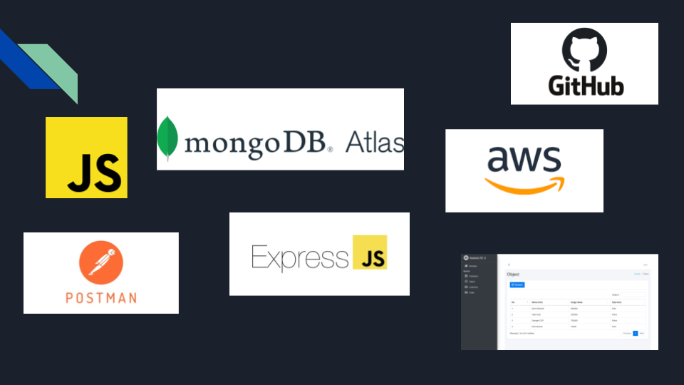

# Documentation


## Run Application


```
npm run dev
```

### Customer User Interface


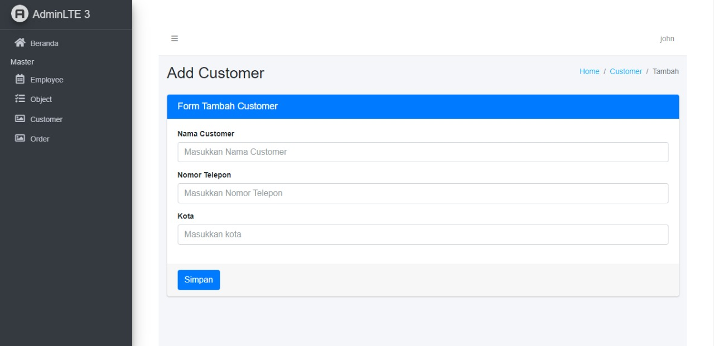

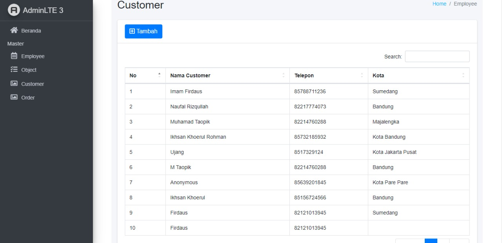

### Employee User Interface 


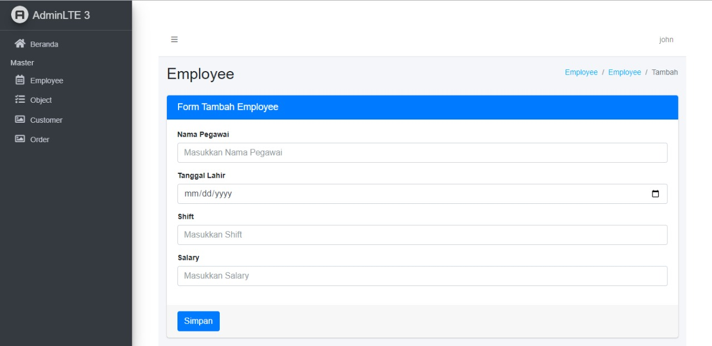

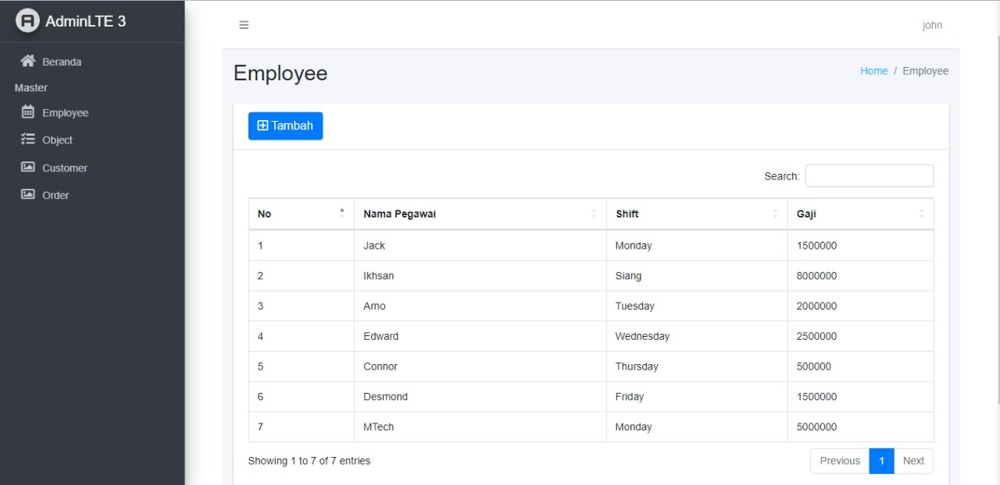

### Object User Interface


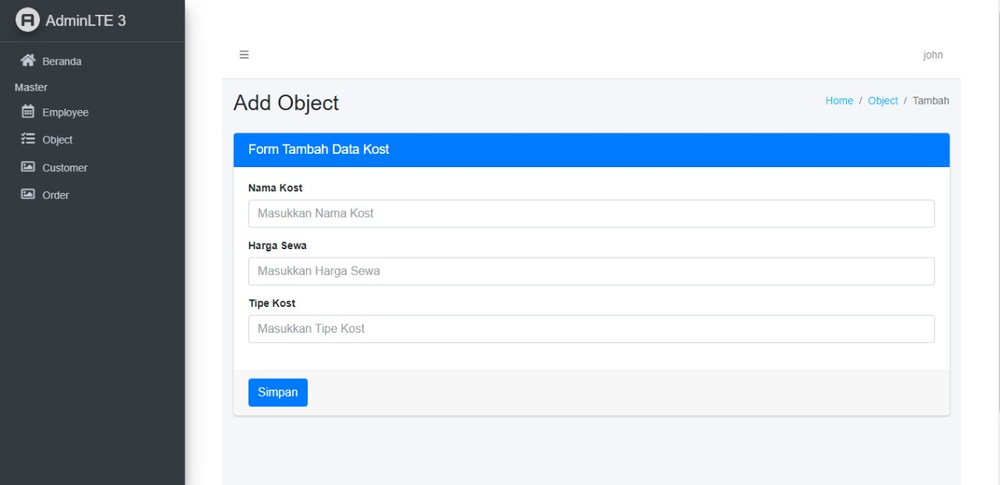

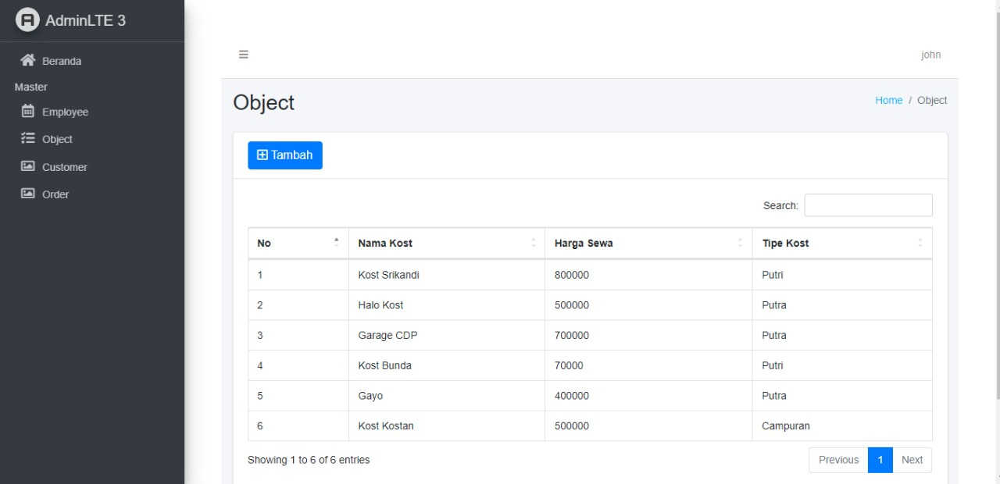

## Customer Service


### Change directory to `customers`
```
cd customers
```

### Install modules
```
npm install
```

### Menjalankan Service
```
nodemon customers.js
```

### PORT
```
http://localhost:3000/
```

### [POST] Customer

`URL:`

```
http://localhost:3000/customer
```

`JSON:`

```
{
    "id_customer":"0003",
    "nama":"Ikhsan Khoerul",
    "telpon":"085156724566",
    "kota":"Bandung"
}
```

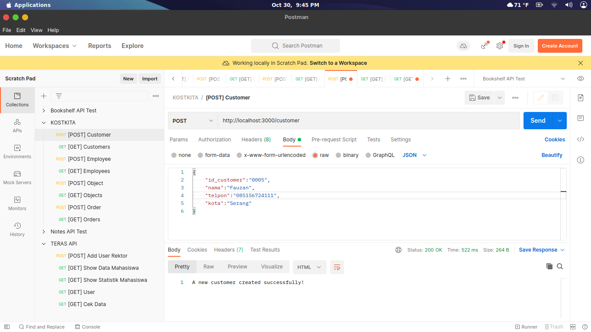

### [GET] Customers

`URL:`

```
http://localhost:3000/customer
```

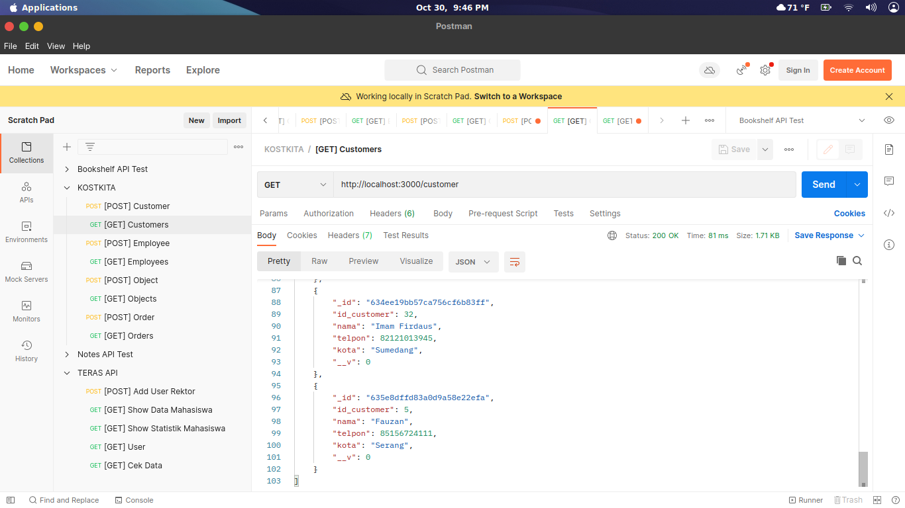

## Employee Service


### Change directory to `employees`
```
cd employees
```

### Install modules
```
npm install
```

### Menjalankan Service
```
nodemon employees.js
```

### PORT
```
http://localhost:4545/
```

### [POST] Employee

`URL:`

```
http://localhost:4545/employee
```

`JSON:`

```
{
    "employee_name":"MTech",
    "employee_birth_date":"2000-08-22",
    "shift":"Monday",
    "salary":"5000000"
}
```

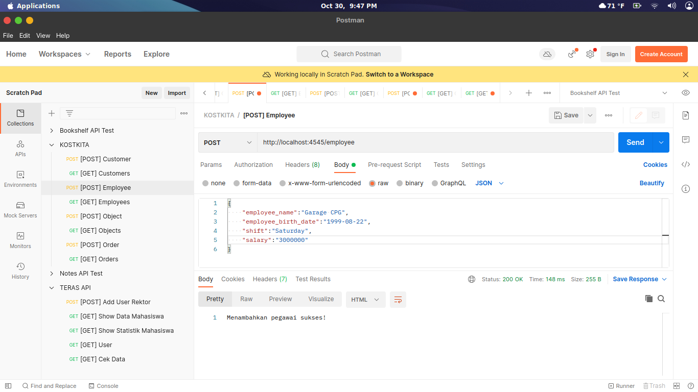

### [GET] Employees

`URL:`

```
http://localhost:4545/employees
```

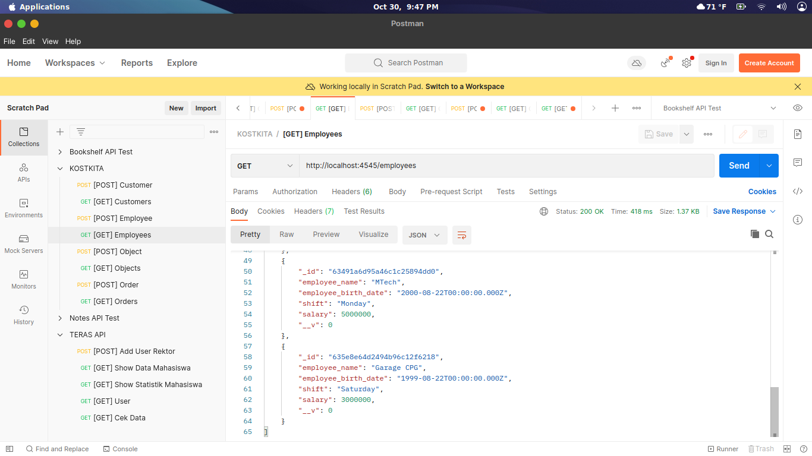

## Object Service


### Change directory to `objects`
```
cd objects
```

### Install modules
```
npm install
```

### Menjalankan Service
```
nodemon objects.js
```

### PORT
```
http://localhost:4000/
```

### [POST] Object

`URL:`

```
http://localhost:4000/object
```

`JSON:`

```
{
    "namaKost": "Gayo",
    "hargaSewa": 400000,
    "tipeKost": "Putra"
}
```

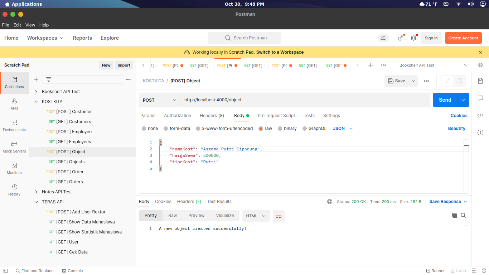

### [GET] Objects

`URL:`

```
http://localhost:4000/object
```

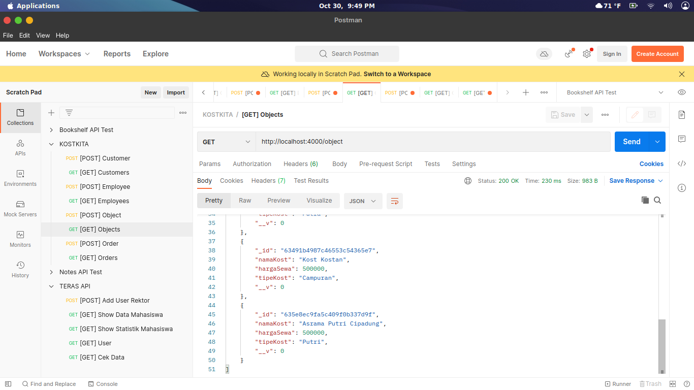

## Order Service


### Change directory to `orders`
```
cd orders
```

### Install modules
```
npm install
```

### Menjalankan Service
```
nodemon orders.js
```

### PORT
```
http://localhost:1201/
```

### [POST] Order

`URL:`

```
http://localhost:1201/order
```

`JSON:`

```
{
    "employeeID": "63491a36c4b3090638141c07",
    "customerID": "634911879be9039886b13a12",
    "objectID": "63491a56cd7464256ecf36e0",
    "orderCode": "ORD789"
}
```

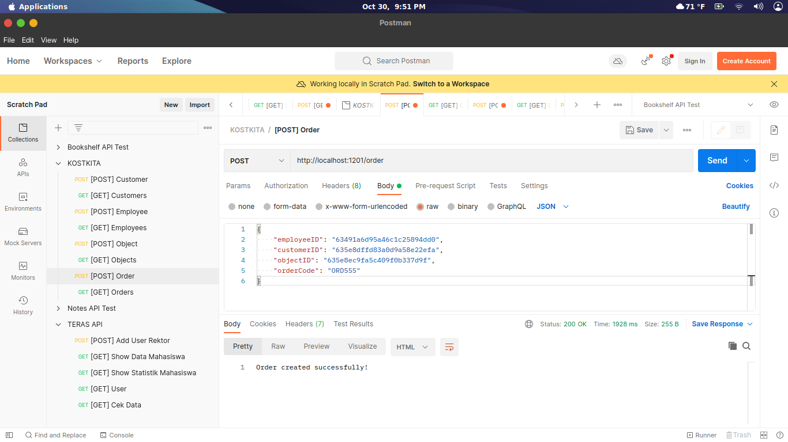

### [GET] Orders

`URL:`

```
http://localhost:1201/orders
```

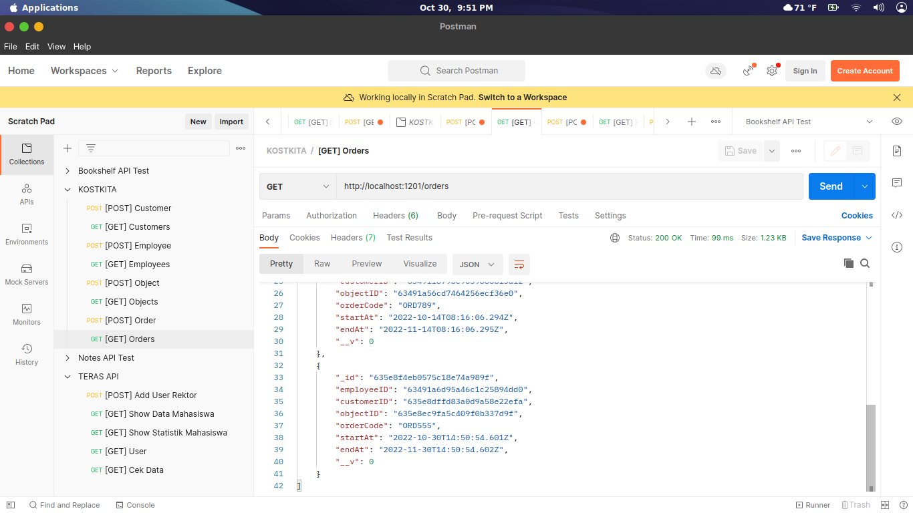